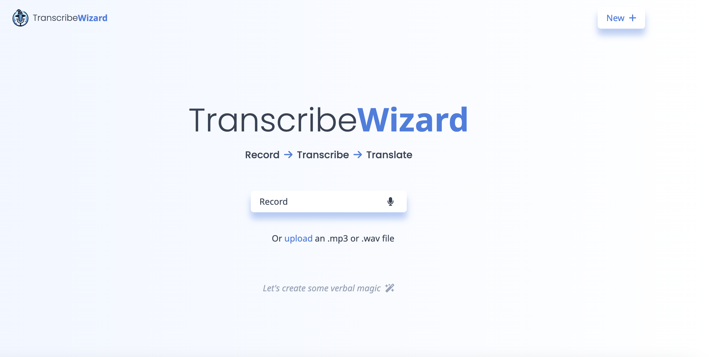
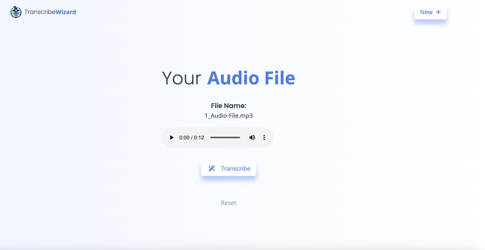

# ML-React-Typescript-App

## Project on Hold

This project was planned as a learning project to learn the fundamentals Typescript.
My Goal was to build an Audio Transcription Tool with a React Frontend and a Rust Backend.

Since I am stuck on both Typescript and Rust at the moment, I will keep this Project as it is at the moment, but I will try to update it as soon as I can.
And as soon as I am able to learn Typescript and Rust more, I will update this project or rebuild it from scratch.

